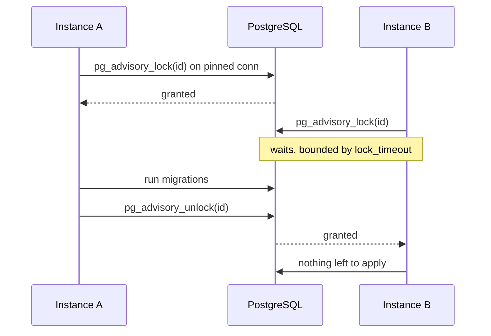
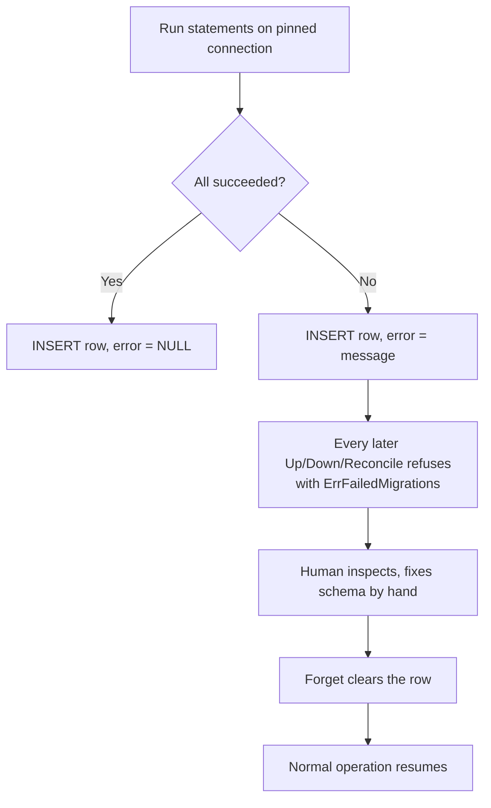

# Concepts

## The advisory lock

Before changing anything, the library takes a PostgreSQL **session-level
advisory lock** on a dedicated connection. Two deployments racing to migrate the
same database serialise instead of interleaving.



### Why the timeout is server-side

The wait is bounded by PostgreSQL's `lock_timeout`, not by cancelling the query
from the client. That distinction is load-bearing: a cancelled query **may
already have been granted the lock**, and since the connection then goes back to
the pool rather than being closed, the lock would be stranded on a pooled
connection with nothing tracking it. A server-side abort is unambiguous — the
lock was not granted.

`lock_timeout` is set with transaction scope, so it reverts on commit and never
leaks onto the pooled connection. The advisory lock itself is session-scoped and
outlives that transaction.

### Why two connections

`(*sql.Conn).Close` returns a connection to the pool; it does not end the
session. A session-level advisory lock survives it. So the lock connection stays
pinned for the whole run while the executor issues its queries through the same
`*sql.DB`.

With `SetMaxOpenConns(1)` the lock would permanently own the only slot and every
other query would hang forever with no way to time out. Rather than deadlock, the
library fails fast with `ErrPoolTooSmall`.

### Configuring it

```go
migrate.WithLockTimeout(30 * time.Second)  // 0 waits indefinitely
migrate.WithLockID(8127364512)             // isolate from another tool's lock
```

The default timeout is 5s for the library and 5m for the CLI — a CLI run is
usually part of a deployment, where a busy lock means another instance is
mid-migration and waiting it out beats failing the rollout.

## Reconciliation

`Reconcile` compares the file source against the bookkeeping table and produces
a plan: what to roll back, what to apply.

| Situation | Without options | With the option |
|---|---|---|
| DB has migrations missing from files | `ErrDivergence` | `WithRollback()` rolls them back |
| Files contain IDs sorting **before** the latest applied | `ErrInterleaved` | `WithInterleaved()` applies them anyway |
| Source empty, DB non-empty | `ErrEmptySource` | `WithAllowEmptySource()` proceeds |

### Interleaved migrations

Two developers branch at `0005`. One merges `0006`, the other merges `0006_b`
after it is already applied. The second migration sorts *before* the latest
applied one — it goes in out of order.

Sometimes that is fine (independent tables). Sometimes it is a disaster (the
later migration assumed the earlier one ran). The library refuses by default and
reports which migrations are affected in `Result.Interleaved`, so the decision is
explicit.

## The bookkeeping table

State lives in a table named `migrations` by default; `WithTableName` and
`WithSchema` change that. Unqualified by default, resolved through the
connection's `search_path`.

| Column | Purpose |
|---|---|
| `seq` | `BIGINT GENERATED ALWAYS AS IDENTITY` — the ordering key |
| `id` | Migration ID (primary key) |
| `up_script` | The up script as applied |
| `down_script` | The rollback script, executed on rollback |
| `applied_at` | `TIMESTAMPTZ` — reporting only, never ordering |
| `error` | `NULL` on success; the recorded failure otherwise |

### Why seq and not applied_at

Wall-clock time is not a reliable order:

- Two migrations applied in the same transaction can share a timestamp exactly.
- Time moves **backwards** across a DST transition, or when two sessions
  disagree about the time zone.

That order decides which migrations "the last N" and a rollback act on. Ordering
by `applied_at` would occasionally roll back the wrong ones — rarely, silently,
and at the worst possible moment. `seq` is monotonic by construction.

## Failure handling

### Transactional migrations

The default. The script and its bookkeeping row commit or fail together — a
failure leaves no trace, and the next run retries from the same state.

### notransaction migrations

There is no transaction to roll back, so the library records what happened:



The bookkeeping write happens **even when the script failed**, and it is detached
from the caller's context with its own timeout. Losing that row is worse than
anything it could report: the next run would re-apply a migration that already
half-ran.

If the schema changed but the row could not be written, you get `ErrUnrecorded` —
the database and the ledger disagree, and that needs a human.

### Why failure is terminal

`ErrFailedMigrations` is not transient. A deployment pipeline should stop, not
retry. Recovering automatically would mean either running a rollback script
against a state it was never written for, or rolling back subsequent successful
migrations. Both destroy work based on a guess about what the operator wanted.

Refusing costs a human a few minutes. Guessing wrong costs data.
