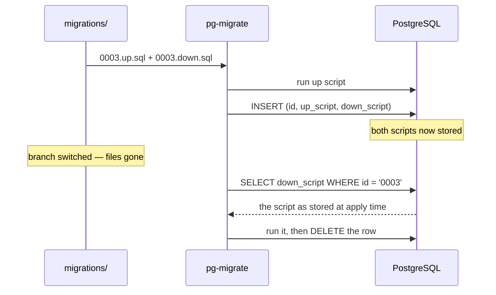

# Migration files

## Naming

Each migration is a **pair** of files sharing a base name. That base name is the
migration ID.

```
migrations/
  0001_create_users.up.sql
  0001_create_users.down.sql
  0002_add_email_index.up.sql
  0002_add_email_index.down.sql
```

Rules the loader enforces:

- **Both halves are required.** A missing `.down.sql` is an error, not an empty
  rollback. If a migration genuinely cannot be undone, say so explicitly with the
  [`irreversible`](#irreversible) directive.
- **IDs sort lexicographically.** Zero-pad numeric prefixes to a consistent
  width. Timestamps (`20260115103000_add_users`) work equally well.
- **Non-`.sql` files are ignored.** A `.sql` file that is neither `*.up.sql` nor
  `*.down.sql` is an error rather than a silent skip.
- **Subdirectories are not traversed.** One flat directory.

## Directives

A file may begin with a single directive line. It must be the **very first
line** — a directive further down is an error, not a comment.

```sql
-- +migrate notransaction
```

Unknown, misspelled or wrongly-cased directives are rejected. `-- +migrate
NoTransaction` will not silently do nothing.

### notransaction

Runs the script statement-by-statement **outside** a transaction, for statements
PostgreSQL refuses inside one.

```sql title="0007_email_index.up.sql"
-- +migrate notransaction
CREATE INDEX CONCURRENTLY idx_users_email ON users(email);
```

!!! danger "A partial failure stays partial"

    Without a transaction there is nothing to roll back. If statement 3 of 5
    fails, statements 1 and 2 are committed and the schema matches no migration.
    The failure is recorded on the migration's row, and every subsequent
    operation refuses until a human resolves it — see
    [Troubleshooting](troubleshooting.md#a-migration-is-recorded-as-failed).

All statements of one script run on a **single dedicated connection**, so
session state carries across them:

```sql
-- +migrate notransaction
SET statement_timeout = 0;
CREATE INDEX CONCURRENTLY idx_big_table ON big_table(col);
```

That connection's session is destroyed afterwards rather than returned to your
pool, so nothing a script sets can contaminate the application.

### irreversible

Belongs in a `.down.sql` that is deliberately empty:

```sql title="0009_drop_legacy_table.down.sql"
-- +migrate irreversible
```

A rollback that would touch this migration is refused with `ErrIrreversible`
**before anything runs** — the check is a pre-flight pass over every candidate,
so you never end up half-rolled-back.

This exists to distinguish a migration that genuinely cannot be undone (a dropped
table, a destructive backfill) from a rollback script somebody forgot to write.
An empty `.down.sql` without the directive is an error.

## Statement splitting

`notransaction` scripts are split into statements before running. The scanner
understands:

- single-quoted literals, including `''` escapes
- `E'...'` escape strings, where `\` escapes the next character
- double-quoted identifiers, including `""` escapes
- dollar quoting — `$$...$$` and `$tag$...$tag$`
- line comments (`--`) and nestable block comments (`/* ... */`)

A semicolon inside any of those is not a boundary.

!!! note

    The scanner assumes `standard_conforming_strings` is on, which has been the
    default since PostgreSQL 9.1. `U&'...'` literals are not treated specially.

### Forcing a boundary

Where a boundary still cannot be inferred, mark the block explicitly:

```sql
-- +migrate notransaction
-- +migrate StatementBegin
CREATE OR REPLACE FUNCTION audit_users() RETURNS trigger AS $$
BEGIN
    INSERT INTO audit(table_name, op) VALUES ('users', TG_OP);
    RETURN NEW;
END;
$$ LANGUAGE plpgsql;
-- +migrate StatementEnd
```

Everything between the markers becomes one statement regardless of what the
scanner would otherwise infer. The markers are matched against the whole trimmed
line, never as a substring, so a line merely mentioning them inside a string
literal is left alone.

## Rollback scripts live in the database

When a migration is applied, **both** scripts are stored in the bookkeeping
table. A rollback executes the stored `.down.sql`, not the file.



Two consequences worth internalising:

- Rollback works when the files are gone. This is the point.
- **Editing an applied migration's file changes nothing.** Not the schema, not
  the stored rollback. To change applied schema, write a new migration.
